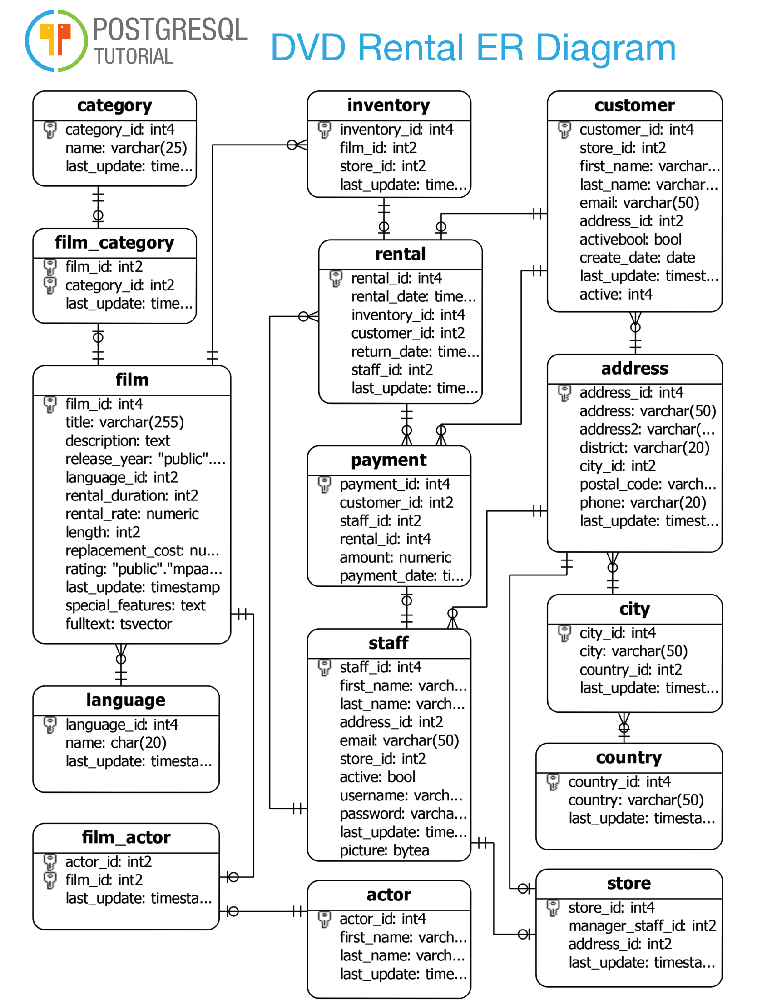

# A Methodology To Rapidly Convert OLTP Databases to OLAP Solutions

Without boring you with all the theory behind my technique, I am going to teach you how I quickly model data warehouses based on transactional systems.

A key to how I design databases is I do not invent things that do not exist. Data models arise naturally and do not need to be forced. 

In order to go through this exercise, we're going to use this ERD.

