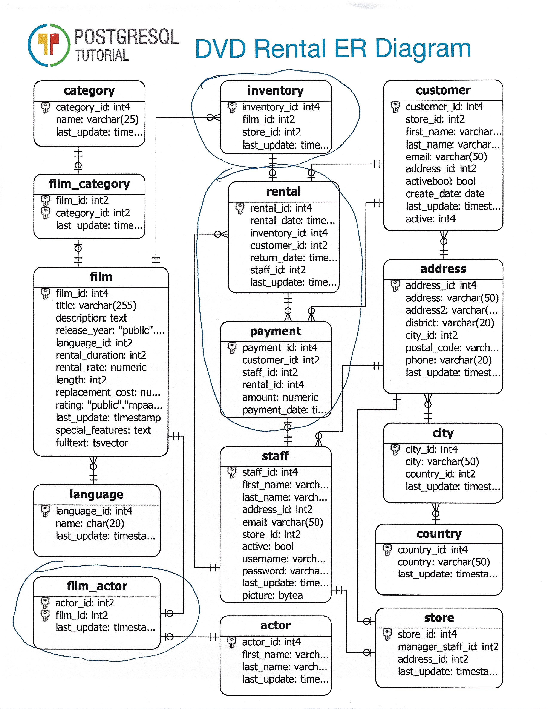

# Step 2:  Find The Stuff We Want To Do Math On

An alternative title for this section might be, what questions do we want to ask of this data. This is where our fact tables come from.

This is a small database and it is mostly made up of nouns, so finding things we want to count is pretty easy. There are a large number of questions we could ask even from a database this small. For this example, I am going to stick to the obvious ones.

1. How many films is this actor in?
2. How many films do we have?
   1. What store are they located in?
3. How much money are we making?
   1. What films are the most profitable?
   2. Who are our high value customers?

