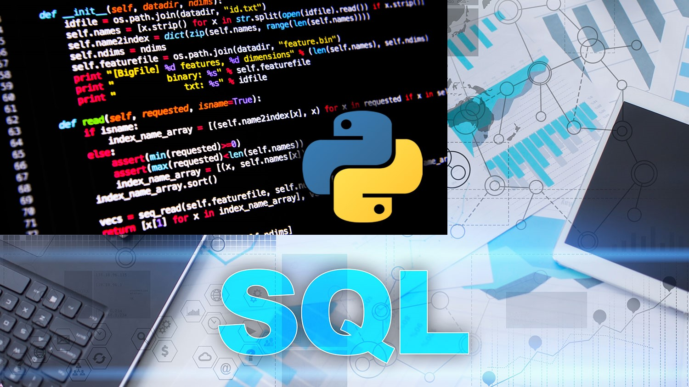

# Appendix B. The Benefits Of Using Python And T-SQL Over SSIS For ETL

“Why use SQL instead of SSIS for ETL?”, or words to that effect is a question I got recently in an interview. Since I am not exactly fast on my feet, I gave an answer that was specific to my skillset. That is not the best way to answer that question. Yes, it is true that, at this point in my career, I can write SQL faster than I can write an SSIS package. But that is not a compelling argument because not everybody has my SQL skills. In this article, I am going to give you five really good business reasons why if you run SQL Server, you should stop using SSIS to build ETL processes.

I moved away from using SSIS to build ETL several years ago because of the reasons I list below. I now use:

1.       T-SQL for anything that involves moving data within or between database servers. I will also use BULK INSERT for importing large CSVs.

2.       Python for anything that T-SQL cannot do like moving or writing files to disk.

In general, the theme of all of these suggestions is moving away from SSIS will save the company tens of thousands if not hundreds of thousands of dollars.

**SSIS Is Not Forward Compatible Usually**

I am qualifying that statement with the word “usually” because this article is written from my personal experience and there might have been an instance where this was not the case. However, I have worked with every major SQL Server release since 2000, and I have never known SSIS to be forward compatible.

What this means is, if your organization decides to upgrade SQL Server, you will have to upgrade all of your SSIS packages as well. I have done a couple SSIS conversion projects. The upgrade can be as simple as running the package conversion process in Visual Studio. However, if you are using a deprecated feature, you may have to redesign numerous SSIS packages. If you are using a lot of SSIS packages for complex ETL, this conversion process can be quite lengthy. You will also have to regression test everything.

In any scenario, upgrading your SSIS packages is an unnecessary cost. Neither Python nor T-SQL suffer from forward compatibility issues. There is an issue moving from Python 2 to Python 3, but those issues can be obviated by:

1.       starting with Python 3

2.       not upgrading to Python 3

If you are already running Python 2 in your organization, there is no need to upgrade to Python 3 just to do ETL.

Both Python and T-SQL will continue to work just fine in newer versions of SQL Server. Python because it has no real relationship to Microsoft. T-SQL because that language is relatively stable, and Microsoft usually only adds features while leaving existing functionality alone.

**Higher Performance**

The slowly changing dimension task in SSIS is not performant. Also, the standard method to load data warehouse fact tables is also not performant compared to an equivalent process with T-SQL. But those statements are only true for experienced T-SQL software engineers.

A better argument is that SSIS by its very nature is not performant. There is a paper floating around that talks about how SSIS holds the record for ETL. However, if you read this paper, you will see that the speed of processing was largely due to network configuration and not much to do with SSIS.

When you create an SSIS package, what you are doing is creating an XML file. The XML file is what gets published and consumed by SQL Server agent or whatever orchestration tool you are using when you push a package to prod. That XML file contains all the information that you “programmed” when you clicked and dragged task around the design surface.

When you deploy an SSIS package, it goes into something called the SSIS catalogue. To be honest, the file goes down a black hole and I am not 100% certain what happens after that. I know how to set it up in SQL Server Agent so it executes, but I do not know the mechanics. I have never bothered to look under the hood because I could never get past the fact that, no matter what was going on, it was an unnecessary step in the warehouse load process.

Python is an interpreted scripting language. It is not compiled like T-SQL stored procedures. However, the amount of Python in your ETL processes should be relatively low. You should be relying mostly on T-SQL. You do that by getting data into a table as quick as you can so you can rely on the database engine. Relational databases are built to join data, so if you are using Python to join datasets in a [medium data](https://massstreetuniversity.com/2020/06/16/the-job-market-for-medium-data-skills/) use case, you are writing inefficient ETL.

It does require some skill, but even the most junior software engineer can develop ETL processes with T-SQL and Python that will outperform SSIS.

Why does performance matter? When writing overnight batch processes, you might think that performance is no big deal. However, you always want to write the fastest performing ETL processes you can for a couple of reasons.

When things break, having a fast ETL process gets you back on track faster. If you have to run the process intraday, you do not want executives waiting for their data any longer than they have to. If you write a package that takes an hour to run, then getting back on track will be defined by:

y = a + b

and b = 1

where

y = total data warehouse unavailability in hours

a = the amount of time it takes to fix issues in the load in hours

b = the amount of time it takes to process unprocessed data in hours

Obviously, you want to minimize b in this equation which is why you want to have the highest performing ETL processes that you can.

The other reason you want fast ETL is because historical data can pile up quick. While the nightly load may add to the total data in a linear fashion, the performance of your code over that data degrades in an exponential fashion. In other words, and this is a simplified example, over time, your data may double, but the performance of your ETL may be four times worse than what you started with.

Always work from the assumption that eventually you will have a ton of data to deal with and write code accordingly. That way, if you have a process that runs really fast over relatively small amounts of data, then, when you have large amounts, the processing degradation will not be as severe.

**Easier To Develop**

I was speaking with a consultant from a third-party firm a client of mine had hired to lend some extra hands to our data warehouse build out project. These guys did not report to me, so we had to have daily meetings to make sure we deconflicted our various areas of responsibility.

During one of these meetings, the consultant said something that made my left eyebrow start to challenge well established altitude records. I was telling him about how I had taken SSIS out of the client’s data warehouse ETL processes and I did not want any more SSIS packages developed.

I was telling him how developing ETL with pure T-SQL orchestrated by SQL Server Agent was superior to SSIS. I am not sure how exactly we got there, but at one point, and with NO sarcasm whatsoever, he says this:

“We use SSIS because we want our junior people to develop the packages because it’s easier for them than writing SQL. That’s how consulting works.”

Jigga what?

First of all, no. I bring my A-team to client engagements and my A-team brings their A-game. There is no JV in business analytics.

Secondly, I reject the premise of the statement. Developing ETL with T-SQL and Python is actually easier than developing SSIS packages. This is not even about developer seniority. I can take a kid with nothing but a high school diploma and no IT experience off the street and have him developing high performing ETL for medium data use cases in a week.

In order to work with databases, you have to know SQL. T-SQL is just an extension of ANSI SQL so the jump from one to the other is not that large. SSIS is this extra thing you have to learn on top of your existing SQL skills. Additionally, SSIS can be rather complex and it takes a while to learn how to create even decently performing packages. Why? Why do that extra work that does not even really gain you any performance benefit?

You could run the argument that Python has a steep learning curve and is harder to learn than SSIS. In reality, Python should have a light footprint in your ETL processes, and you can learn everything you need to know about how to do ETL with Python in a few hours. By that I do not mean an initial set of information to get you started and you get better over time. I mean EVERYTHING you would ever need to know about moving data around on disk outside of SQL Server with Python can be learned in a few hours. Compare that to SSIS which can take months to get good at and years to master enough to be able to tackle any scenario thrown at you.

When you open up an SSIS package, it has to go through all these validation steps before you can start working on your process. If the package does not validate, you have to burn precious minutes or hours trying to figure out why your package will not validate. Sure, you can turn package validation off, but that is not the best of ideas. Why do packages stop validating when you have not even made changes to them? Who knows? What I do know is that T-SQL and Python do not suffer from this problem.

While we are at it, I would mention that you have to develop SSIS packages with a specific integrated development environment \(IDE\). Getting this IDE can be something of a pain because Microsoft likes to play a shell game where you are never quite certain what exactly you need to build SSIS packages. Is it SSDT? Is it Visual Studio? Is it a plug in to Visual Studio? What is Visual Studio Shell? Is that full VS? What exactly is VS Shell \(Integrated\)?!

SERIOUSLY?!

You can develop Python and T-SQL using any IDE you want that will support development in those languages. If you are really cool, you do not even need an IDE. Since both T-SQL and Python are scripting languages that do not need to be compiled, you can develop code with a text editor. If you have a data source name set up, you can execute SQL with Python and all you need is a text editor and the command line.

SQL Server Management Studio \(SSMS\) is a nice tool, but you can use any ODBC compliant editor to connect to SQL server. Last I checked, SQuirreL SQL Client is a good example of this.

Ironically, the seeming ease of use of SSIS encourages junior ETL engineers to build things using anti-patterns. In other words, they create things that are horrific to maintain and there is nothing stopping them especially if there is no senior person around to guide them and/or there is no published style guide for them to follow.

On the other hand, both T-SQL and Python have hard wired rules about how you are supposed to do things. You do not need a senior engineer or style guide \(even though one for T-SQL would be helpful\). The style guide is built into the languages.

T-SQL is a little bit more open, but Python has hard core rules about how it is supposed to look and be developed. If you do not follow those rules, the interpreter will generate a syntax error. You can set a kid down at a machine and be reasonably certain that they are not going to develop a bunch of unreadable junk in Python. Less certain with T-SQL but it really does not matter. Either of those languages are much cleaner and easier to develop processes with than SSIS because of the hard and fast rules built into their respective interpreters.

Python and T-SQL is bumper cars. Letting a junior person write your warehouse ETL with SSIS is like handing the keys to your Porsche to a teenager. Yeah, they are going to go real fast for a bit. But they are going to wind up wrapping it around a pole. By that I mean, they are going to develop brittle, hard to maintain processes. With a little bit of training, that will not happen with Python or T-SQL.

Just to hammer this point home, if I want to loop over some files and perform some file functions, the process for doing that in SSIS is unbelievably complex. Literally unbelievably. You have to use two different tasks. Setting up the Foreach Loop Container takes forever and requires the creation of some variables. Then you have to set up the File System Task. That requires the creation of some more variables, so you have enough flexibility to build file paths and move the files from here to there. You have to be careful about move versus copy because their input parameters are not consistent. Do you need to give it a file name or just a file path? Which requires which? Good lord.

The equivalent process in Python is three lines of code. That is it. Maybe seven lines if you want to get fancy. In either case, it takes all of 20 seconds to set that up and test. In SSIS, just pulling over the task and container, and opening up the configuration on the File System Task will take more than 20 seconds.

So, no. SSIS is not easier to develop than T-SQL or Python. It is actually harder. The point and click interface is a total fake out and executives fall for it all the time much to their detriment.

**Easier To Deploy**

The key to easy deployment actually has nothing to do with code versus point and click. The key is server configuration. Five things need to happen.

1.       A DSN needs set up on all boxes that are for data warehouse work. This DSN needs to be identical on all boxes.

2.       Linked servers need to be set up between the data warehouse box and all internal sources of data.

3.       SQL Server Aliases need to be set up. The alias names should all be the same across all boxes.

4.       Create global environment in the Integration Services Catalog.

**5.**       **All data warehouse related databases should have the exact same name on all boxes.**

Are you catching the theme here? Do stuff so that you do not have to make changes to code or packages as you promote things from dev to production. Do that, and you are halfway there living on a prayer that your ETL process is easy to deploy.

Ease of deployment is critical to meeting service level agreements \(SLAs\). I frequently work under the SLA of, “It’s broken. Fix it yesterday”, so I cannot mess around with difficult to deploy code. Deploying T-SQL and Python is much easier than deploying a package.

First of all, there is no ease of deployment with SSIS even if you do everything I mentioned above. In order to deploy SSIS packages, you have to configure the IDE to deploy your package to the proper server. That is not fun. You have to set up different profiles for each box and the entire process is a pain.

Actually deploying your package is an equal pain. You have to make sure you are in the right profile, then you have to navigate to the proper catalogue. All that is cool if you are pushing to prod one time. If you have to push to dev or test multiple times before things start working right, you will wind up pulling your hair out. People think I shave my head. Nope. Just years of developing ETL with SSIS.

Why do you need to push to dev/test so many times? Fun fact. Your package may run fine in the IDE, but bomb on the server. There are several reasons this might happen so it is not just like you can make a configuration change to the server and fix it. No, you have to wait till it happens, then you have to solve your particular scenario. Mostly, it is a permissions issue. Mostly.

You know how you push changes to existing T-SQL and Python code through different servers?

Python Deployment Process

1.       Copy scripts to proper folder on server.

2.       There is no step 2.

T-SQL Deployment Process

1.       Change connection in SSMS.

2.       Hit F5.

3.       Make a video on TikTok because you have that kind of free time now.

It is not even an argument. Python and T-SQL are orders of magnitude easier to deploy than SSIS packages.

**Easier To Maintain**

When I design ETL processes, I think about high performance fighter aircraft. Sound weird? What do F-16s and ETL processes have in common? Maintenance requirements.

If you get a close look at many modern fighter aircraft, you will notice that the skin of the aircraft is covered in what are clearly panels. You can tell a panel by the outline of the screws you have to undo to remove the panel. These panels are maintenance access hatches. They allow easy access to aircraft systems.

On some older aircraft, in order to maintain some systems, you have to remove other systems that are in the way. In particular, I am thinking of the T-38 where you have to remove the engines to perform certain maintenance functions. The engine does not need fixed, but you have to take it out anyway because the broken system is buried in the fuselage and not near a maintenance access hatch.

I build my ETL processes with a lot of maintenance hatches. When things break, I do not want to have to remove the engine to change a hydraulic line. I just want to pop open a hatch, swap out the bad part, put the hatch back, and start generating sorties.

Ok enough Air Force talk. What does all that look like in my ETL processes?

Identical Independently Executing Processes

In plain English, I build classes of things the exact same way and the execution of one thing has nothing to do with the execution of another thing.

A good example is importing data. All data is pulled into the data warehouse the exact same way. There are some variations on the implementation based on the use case, but in general:

1.       Pull data into staging.

2.       Clean data.

3.       Mark any error records as errors so they are not processed.

Every single source of data has a process developed that is devoted to pulling that specific dataset and nothing else. That process running does not depend on any other data pull process running before or after it.

If it is a demand-pull process that pulls data from a 3rd party vendor, the process will run, but there might be no data to pull because of an error in the 3rd party system. I can only control whatever is in the bounds of the client system. That said, availability of 3rd party data should be addressed in a data contract with a specified SLA. I may not be able to work on their servers, but I sure can make their guys work on their servers.

Audit Columns On Every Table

I use a set of audit columns on every table to help troubleshoot issues. Different types of tables have different subsets of the standard audit columns. There are audit columns for:

1.       Staging tables

2.       Master data management tables

3.       Dimension tables

4.       Fact tables

5.       API tables

An example of an audit column is ErrorReason in staging tables. It is not good enough to mark a record as errored. I want to know WHY it errored. I populate ErrorReason with a plain text explanation of just what went wrong.

And while we are talking about errors, if I want to find all the records that errored out, I do not dump those records to a different table or output them to a file. They stay in staging with the ErrorRecord audit column set to 1. Finding those records is a simple three-line SQL statement.

Once the error is identified and fixed, you can simply set the ErrorRecord column to 0 and run the normal load with no other adjustments. No importing a file. No moving data from an error table back to staging. Just hit the start switch and watch the magic happen. No muss. No fuss.

No OOP In T-SQL

I have seen people try to make T-SQL an object-oriented programming language. What this looks like is stored procedures that call other stored procedures that call views etcetera etcetera ad nauseam. This is an anti-pattern.

Every stored procedure I write is a self-contained process that performs a single task. This kind of process isolation allows for rapid debugging and redeployment of code. Since the process is self-contained, there is only one thing to regression test before pushing the fix to prod.

Self-Diagnostics

Fifth generation fighter jets are pretty smart. When they break, you just plug in a laptop and the jet will tell you what is wrong with it. Too bad babies do not have this feature.

Every ETL process I build has the ability to monitor itself. Aside from the basics of reporting errors, there is a process that monitors the daily delta of the records in the tables. In order to make this happen, I use some basic time series analysis and I borrow a few things from the electrical engineering subject of feedback and control systems.

What I wound up with a system that knows when tables have not been loaded, or if their load is outside what would be considered normal. All the system does is report. It is agnostic to events because there might be good reasons for anomalies. It relies on human interpretation of the data and takes no action on its own.

You may think that is of no value. Let me tell you, when the CFO has a habit of breathing down your neck to get out the daily canned reporting even when its 5 seconds behind schedule, its nice to be able to just fix issues before the CFO even knows about it. Forewarned is forearmed.

Error Notifications

Error notifications should go without saying. However, getting notified of something wrong with the data warehouse can be challenging.

I blast out notifications of errors using SQL Server Agent and T-SQL. I try to make those blast outs go to distros instead of a specific individual. That usually involves working with whoever manages Exchange to get a proper distro built.

I really try to get a mailbox specifically for errors and not just informational notifications. However, if you have seen the average IT person’s corporate mail folder, you know its very easy to have the single error notification mailbox drowned out amongst the couple dozen other mailboxes they have set up.

The only solution for this that I have found is that it has to be someone’s daily task to check that mailbox regardless if there was an alert or not. I have gotten mixed results on this.

The bottom line here is I am just the crew chief. Once I hand off the jet, I cannot be responsible for pilot error. When the annunciator panel says, “hydraulic pressure low”, you cannot just ignore it like a teenager with their first car.

Code Versioning With Git

SSIS packages are just XML files. There is no reason you cannot manage them with Git. However, CIOs have a habit of going all in on Microsoft and prefer that their teams use Team Foundation Server \(TFS\) for versioning your code.

Technically, you could manage your Python and T-SQL using TFS.

Technically, trepanning was a valid medical procedure for exercising demons. Technically.

TFS is that old and busted. Git is the new hotness.

I do not use the new hotness just because it is cool or because it is the versioning tool of choice for modern software development. I use it because, unlike TFS, its really simple, fast, and it works.

Git says goodbye to the outdated concept of checking files in and out. With the distributed model, it is possible to have several people working on the same file at the same time as long as they are not working on the exact same code block.

Imagine a world where you have several people working simultaneously on different methods of a class. Imagine a world where you do not have to lean over to your coworker and utter the words for the millionth time that day, “hey, can you check that file in?”. Imagine a world where TFS does not just fall over and you have to spend the entire afternoon trying to recover your code base.

With Git, that is the world I now live in and it is fantastic. Having Git in my workflow, even working solo on a project has significantly reduced development time for me. The time savings comes from not wrestling with \(and losing to\) TFS. I get all that time back AND my code is robustly stored in more than one location and I can easily move back and forth between different versions of my code base with the click of a button. Life does not get any better than this.

Overall Engineering Philosophy

I build high performing easily maintained processes with six nines of reliability. I let the SQL Server relational engine do what it was designed to do: join data. I use T-SQL to join, cleanse, and load data. I use Python to move data around on disk outside of SQL Server.

The enterprise data warehouse is not something you can cut corners on. It HAS to be right and it has to be highly available, otherwise it will not be used. People will go back to their department specific reports built on transactional systems which slows the transactional system down and everybody gets annoyed which is usually the reason I get hired in the first place. To make everybody stop being annoyed.

The data warehouse is not a place where you can say stuff like, “we can’t let the perfect be the enemy of the good”. In this specific scenario, the “good” is the enemy of a properly functioning system. I build data warehouse ETL to tight tolerances to ensure that everybody maintains faith that the system is popping out reliable, accurate, actionable data in a timely fashion. I get data to the right people, at the right place, at the right time.

ETL processes need care and feeding. There is a human element that you cannot write a workaround for. At the end of the day, somebody has to care that the thing is working right, otherwise everything I just wrote about is totally pointless.

How Does That Compare To SSIS?

SSIS is a hot mess. A lot of the things I have talked about are difficult to impossible to implement with SSIS. Trying to maintain existing processes is a nightmare.

When something breaks in SSIS, you have to open up the package in the IDE which can be a nightmare all its own. Tracking down the error in the system logs, makes you feel like Nicolas Cage’s character in National Treasure, and that is assuming you get good error information at all.

SSIS has a system of event handlers. These are actions that take place when certain events occur. The interface for managing event handlers is not well implemented. Trying to find an event handler, well, let us just say that I have solved a Rubik's Cube faster.

Like I mentioned above, SSIS allows junior engineers to create anti-patterns. A better way to put that is, SSIS allows junior engineers to create unnecessarily labyrinthine packages. They will have task all over the place like some digital Gordian Knot. It will make the wires on your home entertainment center look like a paragon of organization. They will have packages calling other packages. They will use SSIS as an orchestration tool which just unnecessarily adds another layer of orchestration. They will write a huge monolithic package that does everything instead of breaking things down into atomic task that are identical independently executing processes.

You can and should build your SSIS packages to call stored procedures. However, if a stored procedure is busted, you cannot just push the fix. Sometimes, alterations to stored procs require that you add columns to the output query \(the last select statement in a proc\). Any change to the columns of the output query result in new metadata. SSIS reads the metadata from stored procs. If the metadata that it is reading, does not match what it expects, SSIS will error out.

In order to fix it, you have to open up SSIS, go to the data flow tab, open up either the source or the destination task and refresh the metadata. Then you have to redeploy the package. And I ask you. Why? Why do all that when you can just fix the proc, go through change control, change your connection in SSMS, hit F5, and call it a day?

I have already talked about code deployment, but that topic also overlaps with maintenance issues. Getting SSIS packages promoted through your various environments is just harder than it needs to be.

Even if you have a senior SSIS engineer writing packages and that person knows all the tips, tricks, and tactics for writing relatively high performing packages, it still will not matter. SSIS just does not lend itself well to the concept of having many maintenance hatches that allow quick access to subsystems.

Do I sound a little nutty? That is because I have PTSD from dealing with poorly developed SSIS packages. You would not believe what I have dealt with over the years. I have been working on a book called [Mastering Data Warehouse Projects](https://massstreetuniversity.com/book/mastering-data-warehouse-projects/). It has been put on hold due to COVID, but hopefully I can publish this year. In that book, I will be sure to add in some horror stories just so all this will be driven home.

I cannot stress enough. Clean, high performing warehouse ETL. No SSIS. Use T-SQL and Python.

**So In Conclusion…**

Guys, what is the moral of the story here? Time is money. All the time and energy spent on SSIS is just basically lighting $100 bills on fire just to light your Cubans.

**Wanna Learn How I Develop ETL Processes?**

Would you like to know more?

I did not learn this stuff in college. I learned it on the job, under fire. The only reason I know any of this stuff is because, years ago, someone taught me the basics. Ever since then, I have been refining those original ideas. All of that knowledge has been condensed into what I call the [Mass Street Analytics ETL Framework](https://massstreetuniversity.com/etl-framework/). It is my magnum opus and it will never be finished. I keep learning new things and keep refining the original ideas I learned so long ago.

In the framework I give you specific instructions on how to build data warehouse ETL. I also provide you with sample code and sample database objects. Its data warehouse ETL in a box.

It is well documented but setting it up is extremely manual. I have two courses in the works that will explain how to use the framework. Be on the lookout for:

·         SMNR005 How To Rapidly Convert OLTP Databases Into Data Warehouses

·         SMNR006 How To Rapidly Build High Performing Data Warehouse ETL Processes

Until then, if you have questions, feel free to reach out to me on my many MANY social media platforms. DMs are open.

