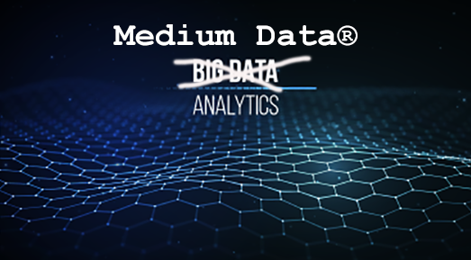

# Appendix A. What is Medium Data®?

Medium Data® can be characterized first and foremost as being not big data. If you think about it in terms of the three Vs—Volume, Velocity, and Variety, then Medium Data® is going to have a volume greater than what can fit in a spreadsheet but not so much that you crash a server trying to load a table. You do not need Hadoop or Parallel Data Warehouse to store Medium Data®. It is happy living on a server with 30 gigs of RAM and a terabyte hard drive.

Velocity. The speed of Medium Data® is somewhere between a glacier and the two-thirds the speed of light. Medium Data® usually is not spewing from a firehose in real time; you can batch process it without a problem.

Variety. Medium Data® is super homogenous, really clean, structured, and fits happily into an old school relational database. It is the mayonnaise of data, and it requires nothing special to process properly.

