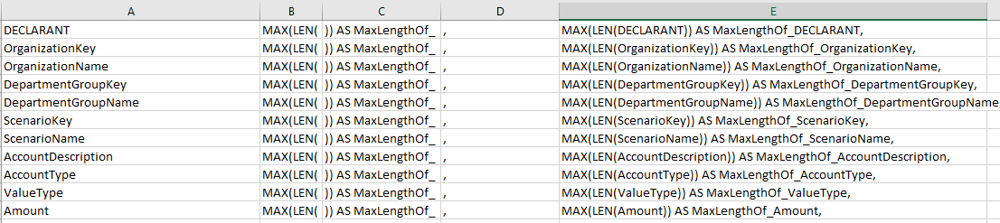

# Char Length Analysis

This tab will help you get an idea of the length of the characters of the data in the staging table. This is important for determining parameter values for string data types.

Again, it is as simple as dropping in the columns from Sample Data. You then take the output and use it as columns in a select statement on the stage table you are looking at.

