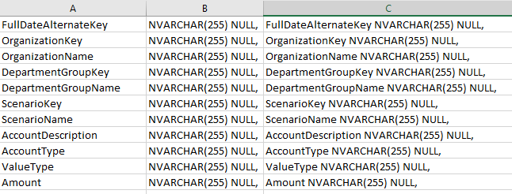

# Create Stage Table

This is the first example of rapid scripting. This tab allows you to quickly create a stage table for your dataset. All you have to do is take the columns from the Sample Data tab and pivot them into column A. The sheet does the rest.

You then take the sheet output and pair it with the sample stage table code and voilà. Done.

