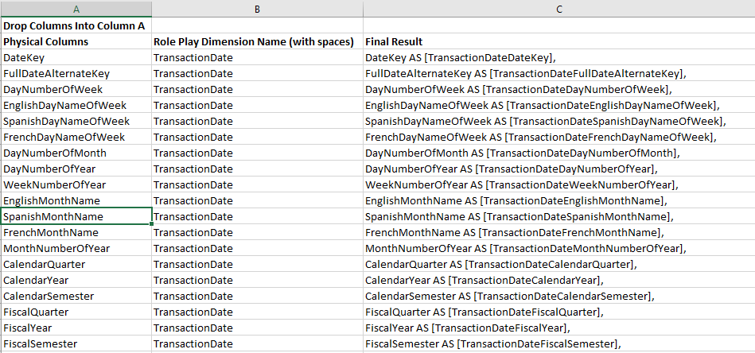

# Date Role Play View Helper

Creating role play dimensions can also be arduous. We need to make sure that the columns in the role play dimension also reflect the name of the role play dimension. For dates, this means creating alias names that set the role play dimension apart from the physical dimension.

Drop your physical dimension columns in column A. Copy down the name of your role play dimension in column B. Final Result will auto populate.

