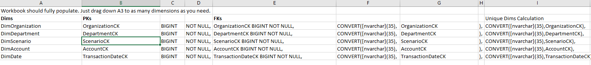

# Fact Table Creation Helper

This tab creates the code to create the Unique Dims Calculation for the fact table. This tab fully auto populates. You just need to drag down the same number of rows of data that is in Dimension List.

