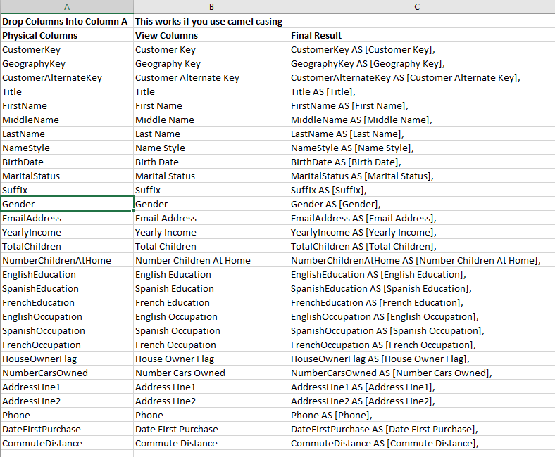

# View Creation Helper

The last step in the creation of your model is turning the dimensional data back into a two dimensional dataset for the semantic layer. That can be quite an arduous task. This tab makes it easier by helping you make aliases for columns by putting spaces in the name.

The function  AddSpaces\(\) does the heavy lifting here. However, the function works only if the column names follow the naming the conventions and are Pascale \(i.e. camel\) cased.

You simply drop your columns in column A and the tab does the rest. 

This tab is for just general views. Later, we will take a look at a tool that is specifically to create a view on the entire model.

