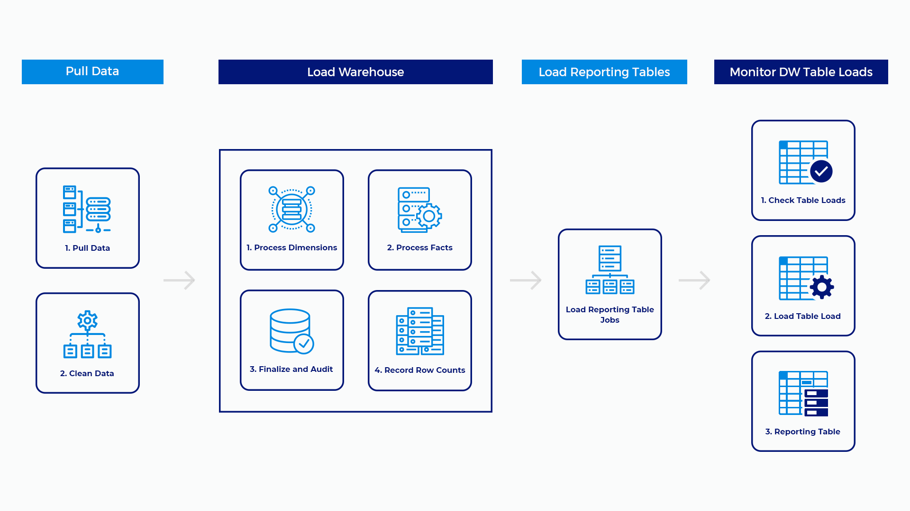

# Data Processing Sequence

**Pull Data**

In general, all processes that acquire data from outside systems pull and clean data in the same step.

**Data Cleansing**

As with any ETL process, some of the data that comes in to the system needs to be cleaned and standardized before it is loaded. Cleaning dates is a common task.

**Load Warehouse**

The actual warehouse load processes is a combination of loading tables and auditing processes that are used to check and make sure everything loaded ok. As you build ETL processes, you will need to make sure to add code that takes these processes into account. All dimensions are processed first; then all fact tables are processed. Fact table loads communicate back to staging to take note of what exactly was loaded to the warehouse. The Finalize and Audit processes checks staging records and reports discrepancies. 

**Load Reporting Tables**

This job is for those processes that load de-normalized reporting tables that reside in the Reporting database only. The reporting tables that live in ODS are only for data professionals and are loaded by different processes.

**Monitor DW Table Loads**

Check Tables Loads will report on unusual record load amounts. Either more than usual or none at all over a three day period are the trigger events. In the final step, volumetric data is dumped into a de-normalized reporting table for easy digest.

