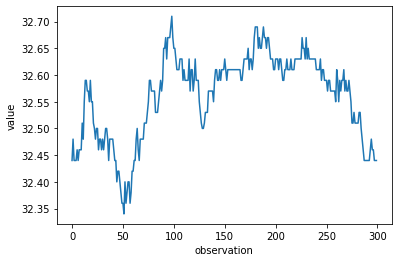
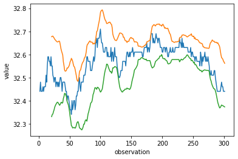
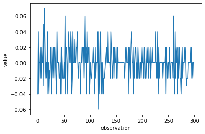
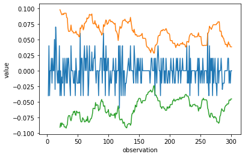

# Passive Monitoring System Design Theory

Despite the fact that volumetric data is discrete in nature, it is still useful to think of the table loads as stochastic processes. The reason for this is, while the daily delta on a table may appear to be stable over time, there is no reason to expect this to continue in the future. It is often the case that a load will exceed alarm limits randomly due to many unknown and interacting variables.

When I thought of the load as a stochastic process, I realized that I could use some of the ideas I had back when I was developing trading algorithms for statistical arbitrage to help monitor and control the flow of data into and out of the system.

When it came to writing trading algos, I was 100% self taught relying on nothing more than a year of undergrad stats at KState and some math training at Washburn. An interesting discovery arose from my research. Anybody that takes a class in time series analysis knows this, but I had to bump into it in the real world to learn about it. 

**A time series that results from a stochastic process will have parameters that change over time.** 

Let me illustrate.

I am not a fan of technical analysis. It is basically voodoo with absolutely no mathematical foundation. There is zero reason that a stock price can't blow through a line of support whenever it wants. However, it is good for making pretty pictures. In this case, I'm going to use Bollinger Bands to illustrate how the mean of a time series drifts over time.

I went to my not insignificant library of data sets and pulled out 22 years of Apple's closing stock price. I threw it in the cloud, and got to work. Below is descriptive statistics of the dataset. 

```python
import pandas as pd
import ta
import matplotlib.pyplot as plt
import numpy as np

ibm_prices = pd.read_csv('https://query.data.world/s/ovn37kwnxqy4txkj4f7s662wxz5ppu')
ibm_prices_subset = ibm_prices[0:300]
del ibm_prices

pd.set_option('display.float_format', lambda x: '%.2f' % x)
ibm_prices_subset.close.describe()
```

| Parameter | Value |
| :--- | :--- |
| Count | 300 |
| mean | 35.56 |
| std | 0.08 |

I can use Mk I Eyeball and tell that this data set is not useful for analysis right away just by seeing that the mean is not 0. Here is a graph of the data.

```python
plt.plot(ibm_prices_subset.close)
plt.ylabel('value')
plt.xlabel('observation')
```



Its stock prices so there are no values less than 0. "So what", you say? The mean is 35.56. Just work with that right? Wrong. You are looking at a static dataset. The dataset we need to work with will be adding values everyday which changes the number of observations which is a key input to several statistical calculations.

What's that you say? Just use a moving average so you can make the number of observations a constant instead of a variable? Bro. That's like the whole thing we're trying to get away from. Let me illustrate.

We're going to take a look at 20 days of data with the standard deviation set at 3.

```python
indicator_bb = ta.volatility.BollingerBands(close=ibm_prices_subset.close, window=20, window_dev=3)
ibm_prices_subset['bb_bbm'] = indicator_bb.bollinger_mavg()
ibm_prices_subset['bb_bbh'] = indicator_bb.bollinger_hband()
ibm_prices_subset['bb_bbl'] = indicator_bb.bollinger_lband()

ma = ibm_prices_subset['bb_bbm']
upper_band = ibm_prices_subset['bb_bbh']
lower_band = ibm_prices_subset['bb_bbl']
price = ibm_prices_subset.close

plt.plot(price)
plt.plot(upper_band)
plt.plot(lower_band)
plt.legend()
plt.ylabel('value')
plt.xlabel('observation')
```



As you can see, as represented by the Bollinger bands, the mean of the price moves over time. This prevents us from understanding what is and what is not weird. 

In the dataset, I've already applied a first difference equation to the data. Let's look at that column.

```python
pd.set_option('display.float_format', lambda x: '%.5f' % x)
ibm_prices_subset[['close','close_first_difference']].describe()
```

| Parameter | Close Price | Close Price Transformed |
| :--- | :--- | :--- |
| count | 300 | 300 |
| mean | 32.56167 | -0.00013 |
| std | 0.07914 | 0.02158 |

As you can see, differencing the data gives us a mean that is arbitrarily close to zero. Here is the graph of what that looks like.

```python
plt.plot(ibm_prices_subset.close_first_difference)
plt.ylabel('value')
plt.xlabel('observation')
```



We now wrap that in Bollinger Bands and, viola.

```python
indicator_bb2 = ta.volatility.BollingerBands(close=ibm_prices_subset.close_first_difference, window=20, window_dev=3)
ibm_prices_subset['bb_bbm2'] = indicator_bb2.bollinger_mavg()
ibm_prices_subset['bb_bbh2'] = indicator_bb2.bollinger_hband()
ibm_prices_subset['bb_bbl2'] = indicator_bb2.bollinger_lband()

ma2 = ibm_prices_subset['bb_bbm2']
upper_band2 = ibm_prices_subset['bb_bbh2']
lower_band2 = ibm_prices_subset['bb_bbl2']
price2 = ibm_prices_subset.close_first_difference

plt.plot(price2)
plt.plot(upper_band2)
plt.plot(lower_band2)
plt.legend()
plt.ylabel('value')
plt.xlabel('observation')
```



As you can see, the mean still moves, but the change in the mean is minute and practically stationary.

Stationarity gives us the ability to apply central limit theorem to the analysis in a consistent manner no matter how far we are from the first observation. It allows us to develop an analysis that is agnostic to direction and we can just focus on the magnitude of the change or delta in nerd parlance.

Stationarity gives us model parameters that are constants and not variables that change with time. This allows us to set alarms when our variable of interest exceeds tolerances. Those tolerances are set at 3SD by default because of the properties of Gaussian Distributions. However, you will need to set your tolerances based on your system. It's not unusual to have processes that are so stable, you can use tighter tolerances.

