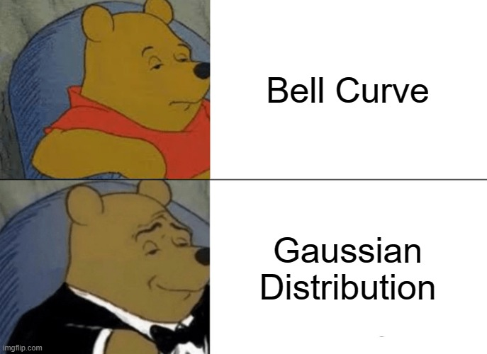

# Time Series Analysis 101

Statistical process control is a key element of DataOps and this framework. We use time series analysis to monitor the health of the load. 

The title of this section is a bit grandiose as a basic treatise of the subject of time series analysis would be a book unto itself. Here we are just going to focus on the concepts you need to implement the monitoring system in the framework. I am not going to throw a bunch of math at you. I am going to break it down Barney style.

The data warehouse load is a stochastic process. That's a five dollar word for random. That is problematic. That means that, in order to model the load of any particular fact table, we'd have to use partial differential equations, Brownian Motion, and a bunch of other things I've long since forgotten and you've never studied to begin with. 

So what are we to do? Easy. Solve the problem with 3rd grade math.

Here is the problem. We want to create a statistical model that will tell us when something weird happens.   Our good ole buddy the bell curve is helpful here.

So what we really need here is, instead of a messy random process, is a nice mean reverting process with a mean of 0 and a standard deviation of 1. How do we get that? Subtraction.

If we take:

$$
\Delta y = x_{t+1} - x_{t}
$$

What you wind up with is a nice time series with a mean that is arbitrarily close to zero. The mean is what is important. The standard deviation less so. With a mean of zero, you wind up with a nice symmetric bell curve even if it's a bit skinnier than we'd like. I prove this in the next section.

With a nice bell curve to play with, we can now create some process constraints that will tell us rather or not the process is in or out of control. We do that with Bollinger Bands.

Bollinger Bands are from technical analysis which I consider about one step over Voodoo. However, we can use the properties of Bollinger Bands to create our process limits.

Bollinger Bands track the mean of the process and are visualized by two additional time series that represent the upper and lower standard deviation. Bollinger Bands have two parameters:

1. How many data points to use to calculate the mean. This is formally called the period.
2. How many standard deviations to represent the upper and lower bands.

The first parameter is somewhat arbitrary and you will need to play with it. I use n=20 from my hedge fund days. 

The second parameter is also technically arbitrary, but the word belies its importance. The standard deviation is your alarm levels. You may also have to tune these before they are dialed in for a particular process. Don't use 3 standard deviations automatically. Remember, our bell curve is not a standard normal distribution with a standard deviation of 1. 3 standard deviations may be too wide for your process.

In the next section, I'm going to prove out everything I just said with data, code, and pictures.

