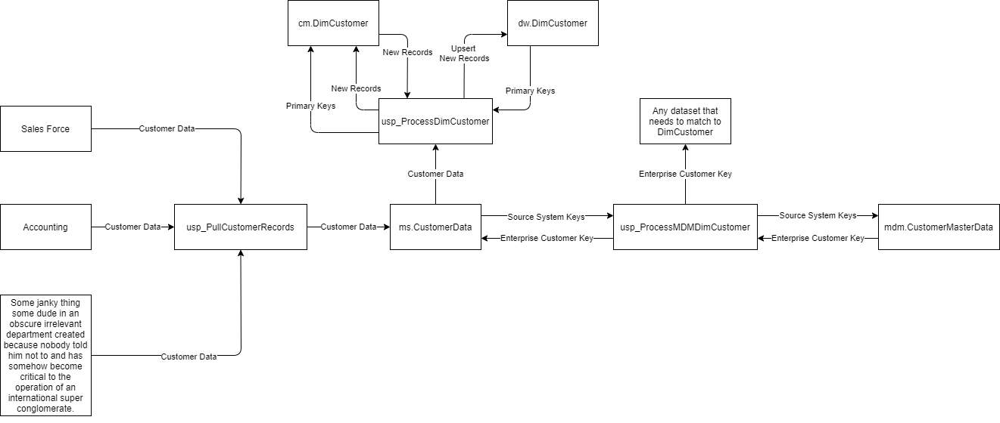

# Implementation Details

For this scenario, we are going to use the example of combing customer data from various systems.

We are going to pull and combine customer data from three different systems.

1. SalesForce
2. Accounting
3. Some janky thing some dude in an obscure irrelevant department created because nobody told him not to and has somehow become critical to the operation of an international super conglomerate.

The key \(no pun intended\) to the system is the master data management table. Using the example code, I built one quickly for this example.

The table contains columns for every key from the source systems in question. Those keys are then hashed in RowHash which has a unique index on it to ensure we get one and only one unique combination  of the keys of the three different source systems.

CustomerEK is simply an autoincrementing number, but that number then becomes the Customer Enterprise Key and the main identifier for a customer in a business analytics context.

The full process is shown below.

The system works like this.

1. A pull proc collects and combines the data from the three systems into a stage table that represents the common model of a customer.
2. An MDM processing doc, pulls the keys from staging and matches them against the CustomerMasterData table in much the same way that the junk dimension load process takes place.
3. A unique combination of keys is identified and assigned a CustomerEK.
4. That enterprise key is then passed back to the record in staging that the original source system keys came from.
5. In addition, any dataset that connects to DimCustomer is also updated in staging.
6. At this point, the normal dimension table load process takes place with the customer enterprise key functioning as the source system key.
7. It is not shown here, but when the fact tables are loaded, all the matching of fact records in staging to DimCustomer will use the enterprise customer key as the source system key.

