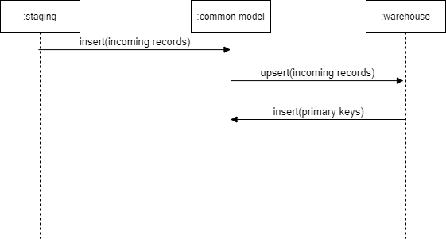

# General Process

The general process is explained as follows:

1. Load the common model table from staging.
2. Merge existing data with incoming data.
   1. Insert new records.
   2. Update existing records.
3. Truncate the common model table.
4. Load the common model table with key fields necessary to populate fact tables.

