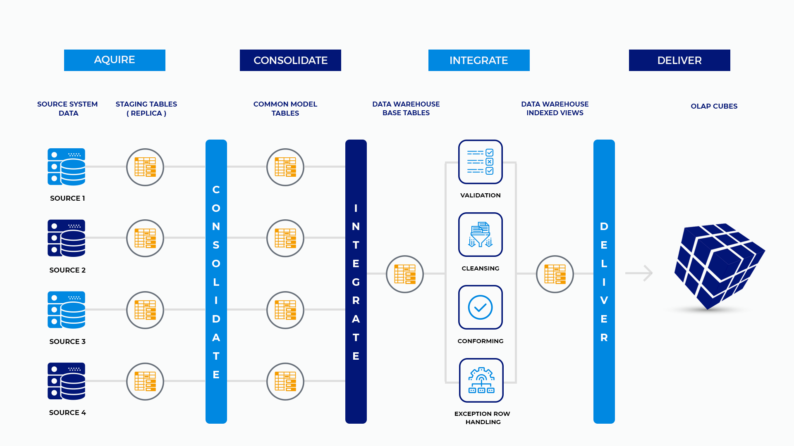

# EDW ETL Overview

The environment is designed to accept data from many sources and combine that data into a single dataflow that terminates in the data warehouse. The data moves through in stages. Each stage will be described below.

Figure 1 represents the load process. Each stage is only loosely coupled to the downstream stage. That is to say that if a particular piece fails, it does not fail the entire process.

**Acquire**

Each ETL process that pulls data into the system is entirely independent of any other process. Each dataset is pulled from its source system and placed in a staging table.

**Consolidate**

All data that is collected in staging tables is moved to common model tables together. The common model is a unified representation of all data across systems.

**Integrate**

Moving data from consolidate to integrate is accomplished in the same step as moving from acquire to consolidate. Integrate is where we move the data from the common model into the warehouse tables.

**Deliver**

At this time, there are no OLAP cubes in the data architecture. Data is delivered through various vectors. Most of those vectors pass through the warehouse. A few bypass the warehouse and go straight to de-normalized reporting tables.

