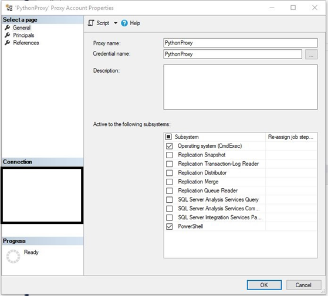

# Create The BIAnalytics Proxy Account

Windows and SQL Server have a sophisticated security scheme. Task cannot be automated by just running them under your user account. You need to set up a proxy under which SQL Server processes can run.

**Step 1** 

Create a new Windows user account called EDWETL. Make this account a normal user. Create a password for this account and remember it.

**Step 2** 

In SSMS, under your SQL Server instance, right click the Security folder and select new-&gt; credential.


  
**Step 3**

Give the new credential the name BIAnalytics . Use EDWETL as the Identity. Make sure you check the name so it has the right domain. Enter the password for the EDWETL account and click ok.

**Step 4** 

Make sure SQL Server Agent is running before you perform this task. Expand SQL Server Agent and find the Proxies folder. Right click and select new proxy. Give it the proxy name of BIAnalytics . Use the BIAnalytics credential. Activate the subsystems as shown below. 

The image is from an older version of documentation. Both Proxy Name and Credential Name should be BIAnalytics.

**Step 5**

Give the proxy account EDWETL, read/write/execute permissions on all directories involved in ETL processing.

Below are further resources on this topic.





