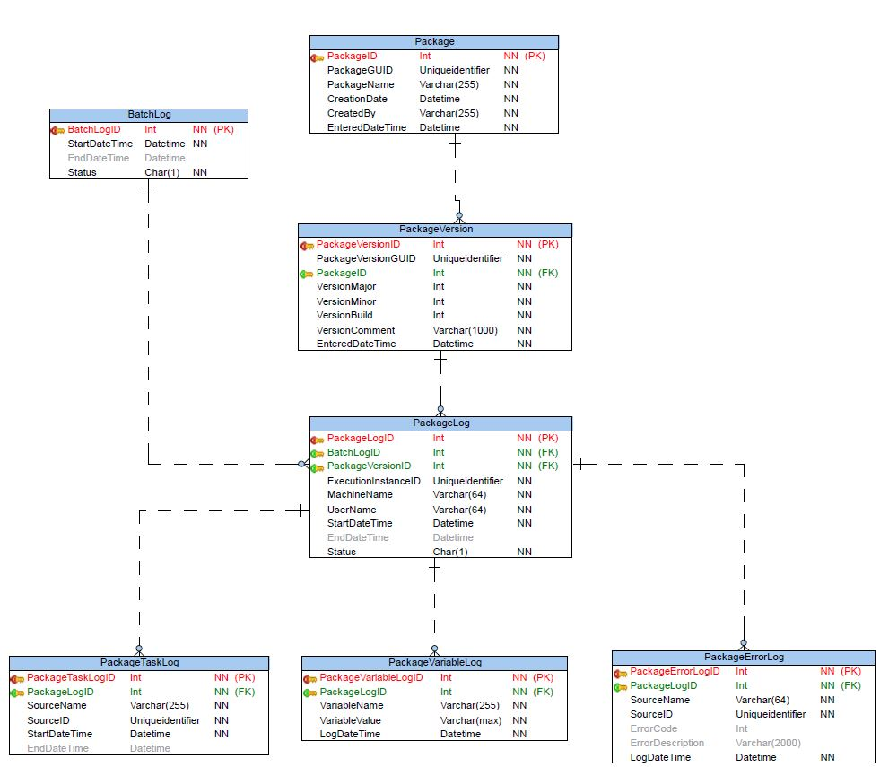

# Logging Database Diagram

Developers are encouraged to write their own procedures for their own troubleshooting needs. The ERD for the logging tables can be found in the file ETL Management Framework Logging Database ERD.pdf



