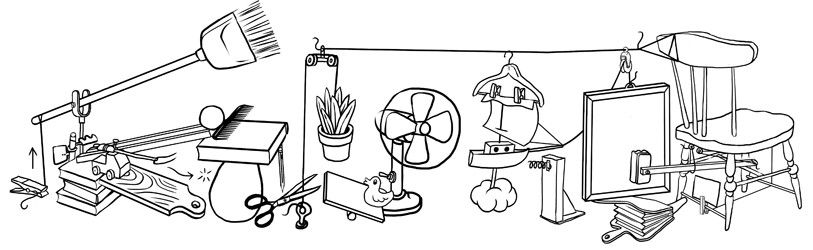

# Why You Need An ETL Framework


**TL:DR: Because a framework will save you hundreds of thousands if not millions of dollars in maintenance cost over the life of your data systems.**

In all likelihood, you will probably have more than one person touching your data architecture. Everybody has opinions about how it should be done, and when one chief architect leaves, the next one will implement his or her opinionated solution. You also may have various teams working data and creating products and applications; they also have their own way of doing things. Eventually, you wind up with an unmanageable Rube Goldberg machine, and you will spend so much time on maintenance issues, it will be next to impossible to have time to create anything new. Maintenance issues is NOT a good use of your data engineers. They need to be creating cool things that generate revenue or cut costs, not sitting there racking up costs.

Having an ETL framework prevents the Rube Goldberg machine from being created. By having a strict set of rules and consistent governance, you can wind up saving the organization millions of dollars in wasted developer time.

\*\*\*\*

\*\*\*\*

