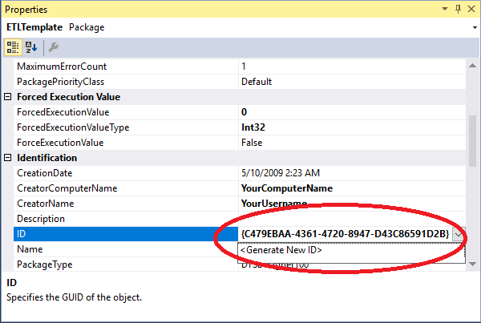

# Starting A New Process

When you start a new project follow these steps:

1. Create a new solution and add the existing template ETLTemplate.dtsx
2. In package properties click ID and select generate new ID.
3. Change the CreationDate to today’s date.
4. Change the CreatorComputerName to your computer.
5. Change the CreatorName to your name.
6. Fill in the VersionComments, VersionMajor, and VersionMinor.

